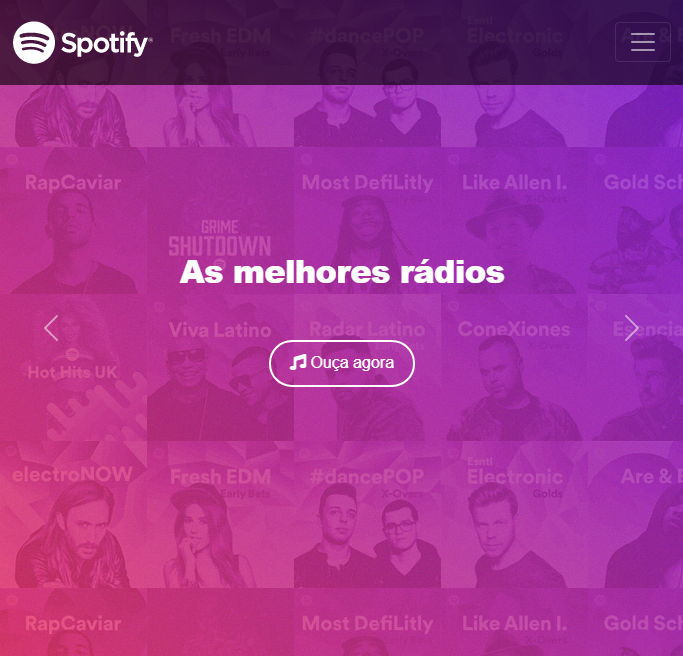
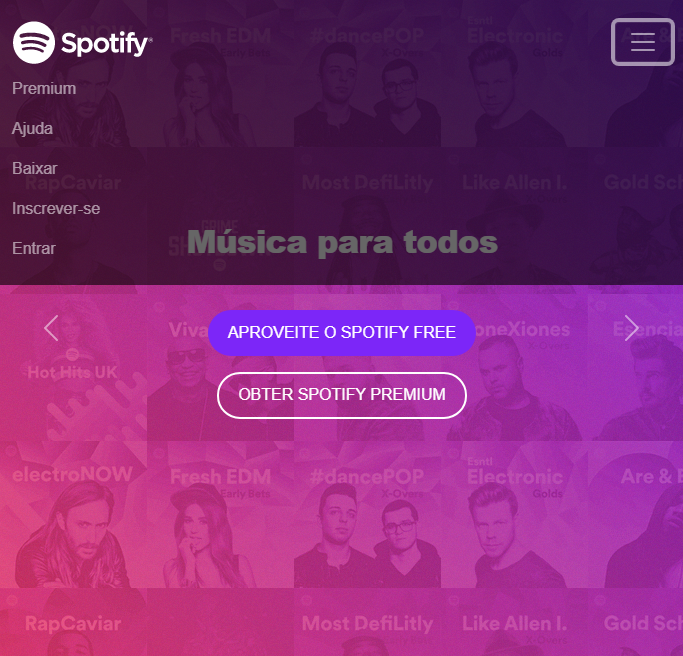

<h1 align="center">
  Spotify Clone
</h1>

    Spotify is a world-renowned music platform

Project developed after the <strong>course "Desenvolvimento Web Moderno Completo 2021 - 20 Projetos</strong> by instructor Jamilton Damasceno | <a href="https://www.udemy.com/">Udemy</a>

In this project, I learned many important concepts of the of the Bootstrap framework, such as Grid, Containers and many of its components.

  Made with dedication by <a href="https://github.com/mateuslsilva28/">Mateus Coelho da Silva

# :camera: Screenshoots

 
    <h2 align="center">Desktop</h2>
    
    <h2 align="center">Mobile</h2>
    
    

# :rocket: Technologies
In this project I used the following technologies

* [Html 5](https://developer.mozilla.org/pt-BR/docs/Web/HTML)
* [Css 3](https://developer.mozilla.org/pt-BR/docs/Web/CSS)
* [Java Script](https://developer.mozilla.org/pt-BR/docs/Web/JavaScript)
* [Bootstrap](https://getbootstrap.com/)

# :sparkles: Contributing

- Fork this repository;
- Create a new branch to develop your feature: `git checkout -b my-feature`;
- Commit your changes: `git commit -m 'feat: my new feature'`;
- Push to your branch: `git push origin my-feature`.
